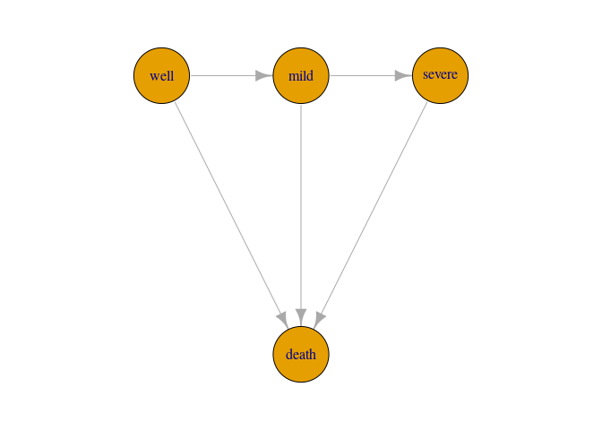

<!-- README.md is generated from README.Rmd. Please edit that file -->

# smms: Semi-Markov Multi-State models for interval censored data

The `smms` package allows you to fit Semi-Markovian multi-state models
to panel datasets. The package constructs and optimises the likelihood
of arbitrary multi-state models where the possible state transitions can
be described by an acyclic graph with one or more initial states and one
or more absorbing states.

Designed for data where the exact state transitions are not necessarily
observed, so that we have interval censoring of the transition times.
Data like these are sometimes referred to as panel data.

The methodology is explained in the paper [A new framework for
semi-Markovian parametric multi-state models with interval
censoring](https://www.mn.uio.no/math/english/research/projects/focustat/publications_2/multistate_final_july2022.pdf)
by Aastveit, Cunen and Hjort (2022). The code used for the application
and simulations in the paper is available in the `scripts` folder.

## Installation

In order to directly install the package from github, you need the
package `devtools`.

``` r
install.packages("devtools")
devtools::install_github("NorskRegnesentral/smms")
```

<!--
# Whats new

### Version xx


See NEWS.md for changes for complete version history.
-->

## Overview

The main function in this package is the `smms` function, which is used
to fit a multi-state model. The user needs to provide a datasets of
states and time-points for multiple units of observation, typically
referred to as *patients*, a graph describing the states and the
possible transitions between them, and a set of parametric densities,
and survival functions.

In the next section, we will illustrate the use of the `smms` function
in a simple example.

## A simple example

We will use the CAV dataset from the `msm` package (Jackson 2011) as an
illustration. The dataset monitors a number of patients for a number of
years after heart transplantation. Coronary allograft vasculopathy (CAV)
is a condition potentially occurring after hear transplantation. At each
time-point the patients are assigned to one of four states: well, mild
CAV, severe CAV and death. The time of death is recorded precisely, but
the times of entrance into the CAV-states are interval censored

Here we see the observations belonging to two patients. Note here that
the states were originally numbered from 1 to 4, but for the sake of
this illustration I have changed the state names to “well”, “mild”,
“severe” and “death”. This is to demonstrate that the package accepts
names as both numbers and strings.

``` r
library(smms)
library(igraph) # For specifying the multi-state graph 
library(msm) # To get the CAV dataset

dd = cav
dd = dd[!is.na(dd$pdiag),]

# Remove observations where the patient appears to go back to a previous state (assumed to be impossible):
id_wrong = unique(dd$PTNUM[which(dd$state!=dd$statemax)])  
dd = dd[-which(dd$PTNUM %in% id_wrong),]

# Change state names from 1,2,3,4 to well, mild, severe, death
tab = data.frame(state=1:4,name=c("well","mild","severe","death"))
dd$state = tab$name[match(dd$state,tab$state)]

dd = dd[ ,-c(2, 5, 7, 9, 10)]
colnames(dd)[1:2] <- c("patient","time") # rename relevant columns (necessary in current version)

print(dd[1:11,])
```

    ##    patient     time dage pdiag  state
    ## 1   100002 0.000000   21   IHD   well
    ## 2   100002 1.002740   21   IHD   well
    ## 3   100002 2.002740   21   IHD   mild
    ## 4   100002 3.093151   21   IHD   mild
    ## 5   100002 4.000000   21   IHD   mild
    ## 6   100002 4.997260   21   IHD severe
    ## 7   100002 5.854795   21   IHD  death
    ## 8   100003 0.000000   17   IHD   well
    ## 9   100003 1.189041   17   IHD   well
    ## 10  100003 2.008219   17   IHD severe
    ## 11  100003 2.991781   17   IHD  death

Next we specify the model graph. Here we assume a four-state illness
death model, since we consider CAV to be irreversible (so we do not
allow for patients to move back to less severe states). It is convenient
to stick to the same naming/numbering when specifying the model graph.

``` r
# Specify the graph:
gg = graph_from_literal("well"--+"mild"--+"severe"--+"death", "well"--+"death", "mild"--+"death")
par(mar=c(2,2,2,2))
plot(gg,layout=layout_with_sugiyama(gg,layers=c(1,1,1,2))$layout,vertex.size=40)
```



# References

-   Jackson CH (2011). [Multi-State Models for Panel Data: The msm
    Package for R.](https://www.jstatsoft.org/v38/i08/) Journal of
    Statistical Software, 38, 1–29.
