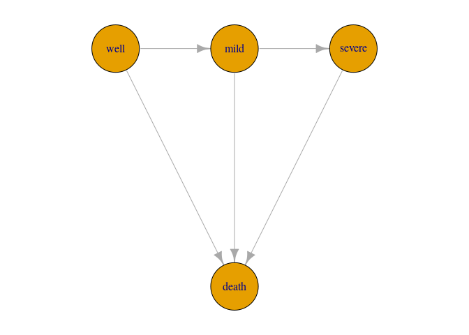

<!-- README.md is generated from README.Rmd. Please edit that file -->

# smms: Semi-Markov Multi-State models for interval censored data

The `smms` package allows you to fit Semi-Markovian multi-state models
to panel datasets. The package constructs and optimises the likelihood
of arbitrary multi-state models where the possible state transitions can
be described by an acyclic graph with one or more initial states and one
or more absorbing states.

Designed for data where the exact state transitions are not necessarily
observed, so that we have interval censoring of the transition times.
Data like these are sometimes referred to as panel data.

The methodology is explained in the paper [A new framework for
semi-Markovian parametric multi-state models with interval
censoring](https://www.mn.uio.no/math/english/research/projects/focustat/publications_2/multistate_final_july2022.pdf)
by Aastveit, Cunen and Hjort (2022). The code used for the application
and simulations in the paper is available in the `scripts` folder.

## Installation

In order to directly install the package from github, you need the
package `devtools`.

``` r
install.packages("devtools")
devtools::install_github("NorskRegnesentral/smms")
```

<!--
# Whats new

### Version xx


See NEWS.md for changes for complete version history.
-->

## Overview

The main function in this package is the `smms` function, which is used
to fit a multi-state model. The user needs to provide a datasets of
states and time-points for multiple units of observation, typically
referred to as *patients*, a graph describing the states and the
possible transitions between them, and a set of parametric densities,
and survival functions.

In the next section, we will illustrate the use of the `smms` function
in a simple example.

## A simple example

### Data

We will use the CAV dataset from the `msm` package (Jackson 2011) as an
illustration. The dataset monitors a number of patients for a number of
years after heart transplantation. Coronary allograft vasculopathy (CAV)
is a condition potentially occurring after hear transplantation. At each
time-point the patients are assigned to one of four states: well, mild
CAV, severe CAV and death. The time of death is recorded precisely, but
the times of entrance into the CAV-states are interval censored

Here we see the observations belonging to two patients. Note here that
the states were originally numbered from 1 to 4, but for the sake of
this illustration I have changed the state names to “well”, “mild”,
“severe” and “death”. This is to demonstrate that the package accepts
names as both numbers and strings. After deleting some observations that
are deemed incorrect (because they appear to get better, see next
paragraph), we end up with 2398 observations in 556 different patients.

``` r
library(smms)
library(igraph) # For specifying the multi-state graph 
library(msm) # To get the CAV dataset

dd = cav
dd = dd[!is.na(dd$pdiag),]

# Remove observations where the patient appears to go back to a previous state (assumed to be impossible):
id_wrong = unique(dd$PTNUM[which(dd$state!=dd$statemax)])  
dd = dd[-which(dd$PTNUM %in% id_wrong),]

# Change state names from 1,2,3,4 to well, mild, severe, death
tab = data.frame(state=1:4,name=c("well","mild","severe","death"))
dd$state = tab$name[match(dd$state,tab$state)]

dd = dd[ ,-c(2, 5, 7, 9, 10)]
colnames(dd)[1:2] <- c("patient","time") # rename relevant columns (necessary in current version)

print(dd[1:11,])
```

    ##    patient     time dage pdiag  state
    ## 1   100002 0.000000   21   IHD   well
    ## 2   100002 1.002740   21   IHD   well
    ## 3   100002 2.002740   21   IHD   mild
    ## 4   100002 3.093151   21   IHD   mild
    ## 5   100002 4.000000   21   IHD   mild
    ## 6   100002 4.997260   21   IHD severe
    ## 7   100002 5.854795   21   IHD  death
    ## 8   100003 0.000000   17   IHD   well
    ## 9   100003 1.189041   17   IHD   well
    ## 10  100003 2.008219   17   IHD severe
    ## 11  100003 2.991781   17   IHD  death

### Specifying the model graph

Here we assume a four-state illness death model, since we consider CAV
to be irreversible (so we do not allow for patients to move back to less
severe states). It is convenient to stick to the same state names as in
the dataset when specifying the model graph.

``` r
# Specify the graph:
gg = graph_from_literal("well"--+"mild"--+"severe"--+"death", "well"--+"death", "mild"--+"death")
par(mar=c(1,1,1,1))
plot(gg,layout=layout_with_sugiyama(gg,layers=c(1,1,1,2))$layout,vertex.size=40)
```

 ##\#
Specifying parametric models

Then, the user has to specify parametric models for all transition times
(meaning one for each edge in the graph). In the current version of the
package, these models have to be specified by providing density
functions (in a specific format detailed below), as well as the
corresponding survival functions. The functions will look like the
following if one chooses to use simple exponential models for all
transitions (i.e. meaning that we are fitting a homogeneous Markov model
which could have been fitted with the `msm`package too - but this is for
the sake of a simple illustration):

``` r
f_01 = function(param, x, tt){dexp(tt,exp(param[1]))}
f_12 = function(param, x, tt){dexp(tt,exp(param[2]))}
f_23 = function(param, x, tt){dexp(tt,exp(param[3]))}
f_03 = function(param, x, tt){dexp(tt,exp(param[4]))}
f_13 = function(param, x, tt){dexp(tt,exp(param[5]))}

S_01 = function(param, x, tt){1-pexp(tt,exp(param[1]))}
S_12 = function(param, x, tt){1-pexp(tt,exp(param[2]))}
S_23 = function(param, x, tt){1-pexp(tt,exp(param[3]))}
S_03 = function(param, x, tt){1-pexp(tt,exp(param[4]))}
S_13 = function(param, x, tt){1-pexp(tt,exp(param[5]))}
```

Important to note:

-   **the names of the functions**: these have to be in the form `f_ij`
    and `S_ij` with i indicating the source state (in the internal
    numbering system) and j indicating the receiving state. More details
    on the naming convention below.
-   **the arguments of the functions**: these should always be given as
    `(param, x, tt)` as above. `x` will point to the vector of measured
    covariates (for a patient) when these are present. When there are no
    covariates, like in this example, `x` should still be present as an
    argument, but will not be called within the functions. In the
    vignettes we include examples with covariates.
-   **the scale of the parameters**: for the sake of stable optimisation
    it is convinient that the parameters live on the real line (instead
    of the positive half-line as in the common parameterisation of the
    exponential distribution). Therefore, we include an exponential
    transformation of the `param` vector, and we recommend that
    transformation for all positive parameters.
-   **the ordering of the parameters**: `param`denotes the full
    parameter vector for the model.
-   Survival functions should be written so that they return 1 when `tt`
    is negative. Using build-in R CDFs for distributions over the
    positive half-line will ensure this. Otherwise, if the user codes
    the survival functions herself, she should ensure that they return 1
    when `tt`is negative. We include an example with user-specified
    distribution functions in the vignettes.

As we saw above, the user has to follow a strict naming convention when
specifying the densities and survival functions: within the package, the
states are numbered from 0 to k-1 (k being the number of states), in a
specific order which depends on the graph. To find out how the user
defined state names relate to the internal numbering system, use the
`names_of_survival_density` function. This allways recommended before
specifying the model:

``` r
print(names_of_survival_density(gg))
```

    ##   edge_name survival_name density_name from_prev to_prev  type
    ## 1        01          S_01         f_01      well    mild trans
    ## 2        03          S_03         f_03      well   death   abs
    ## 3        12          S_12         f_12      mild  severe trans
    ## 4        13          S_13         f_13      mild   death   abs
    ## 5        23          S_23         f_23    severe   death   abs

Here we see for example that the density for the edge between “mild” and
“severe” should be named `f_12`(as we do above).

## References

-   Jackson CH (2011). [Multi-State Models for Panel Data: The msm
    Package for R.](https://www.jstatsoft.org/v38/i08/) Journal of
    Statistical Software, 38, 1–29.
