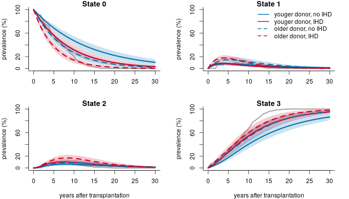
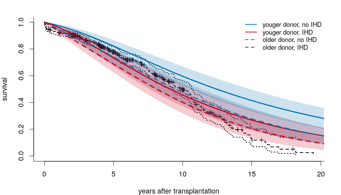

```{r setup, include=FALSE}
rm(list = ls())
devtools::load_all() 
```

# Introduction: the CAV dataset

Describe dataset, show graph.

Specifying the graph: 

```{r }
library(msm)
gg = graph_from_literal("well"--+"mild"--+"severe"--+"death", "well"--+"death", "mild"--+"death")
plot(gg,layout=layout_with_sugiyama(gg,layers=c(1,1,1,2))$layout,vertex.size=40)
```

Mention that we delete those few patients which appear to become less ill with time. 
We end up with 2398 observations in 556 different patients.

Give an overview of observed transitions?

## Exponential model with covariates

Could also have been fit with the msm package. Included here as an illustration.

### Specifying the models for the transition times

Explain:

* Naming conventions: S_ij and f_ij. To find out which edges the functions belong to, use **names_of_survival_density()** (see below)
* The user needs to keep track of the ordering of the parameters. For numerical reasons it is adviced to let all parameters live on the real line
(i.e. transforming all positive parameters by exp).
* Naturally, the user may force some transitions to be governed by the same parameters (if there is reason to believe that is the case). 
* Survival functions should be written so that they return 1 when t is negative. Using build-in R functions on positive half-line
will ensure this. Otherwise the user should ensure this herself.
* Not sure if is is important to include **as.numeric(t>=0)** still. Need to check this.
* Covariates can be included in different ways (show another example?)

```{r }
S_01 = function(param, x, t){(1-pexp(t,exp(param[1]+param[2]*x[1]+param[3]*x[2])))}
S_12 = function(param, x, t){(1-pexp(t,exp(param[4]+param[5]*x[1]+param[6]*x[2])))}
S_23 = function(param, x, t){(1-pexp(t,exp(param[7]+param[8]*x[1]+param[9]*x[2])))}
S_03 = function(param, x, t){(1-pexp(t,exp(param[10]+param[11]*x[1]+param[12]*x[2])))}
S_13 = function(param, x, t){(1-pexp(t,exp(param[13]+param[14]*x[1]+param[15]*x[2])))}

f_01 = function(param, x, t){as.numeric(t>=0)*dexp(t,exp(param[1]+param[2]*x[1]+param[3]*x[2]))}
f_12 = function(param, x, t){as.numeric(t>=0)*dexp(t,exp(param[4]+param[5]*x[1]+param[6]*x[2]))}
f_23 = function(param, x, t){as.numeric(t>=0)*dexp(t,exp(param[7]+param[8]*x[1]+param[9]*x[2]))}
f_03 = function(param, x, t){as.numeric(t>=0)*dexp(t,exp(param[10]+param[11]*x[1]+param[12]*x[2]))}
f_13 = function(param, x, t){as.numeric(t>=0)*dexp(t,exp(param[13]+param[14]*x[1]+param[15]*x[2]))}
```

To make sure how the user defined node/state-names relate to the naming convention within the package:

```{r }
names_of_survival_density(gg)
```

### Fitting the model

Show code for fitting the model

### Results

Estimates and confidence intervals 
```{r }
load("cav_expo_cov_optims")
estimates <- oo$par
round(exp(est_ci(estimates,hessian)),2)
```

Some interpretation


Figures of occupancy probabilities

```{r ,eval=F}
tval <- seq(0.01,30,length=50)
p0_y0 <- occupancy_prob("0",tval,estimates,gg,xval=c(-1,0))
p0_y0_ci <- occupancy_prob_ci_band("0",tval,estimates,gg,xval=c(-1,0),hessian)
```

"0" for the initial state, **c(-1,0)** for specific covariate values. If one ones to include confidence bands choose the second option (then one needs the hessian matrix as well).
Do this for all states, and all combinations of covariate values one is interested in:


```{r, echo=FALSE, fig.cap="A caption", out.width = '75%'}

```


Figure of overall survival

```{r ,eval=F}
Sy0 <- overall_survival(tval,aa,gg,c(-1,0))
Sy0_ci <- overall_survival_ci_band(tval,aa,gg,c(-1,0),hessian)
```

 **c(-1,0)** for specific covariate values. If one ones to include confidence bands choose the second option (then one needs the hessian matrix as well).
Do this for all combinations of covariate values one is interested in:


```{r, echo=FALSE, fig.cap="A caption", out.width = '75%'}

```

## Weibull model with covariates


